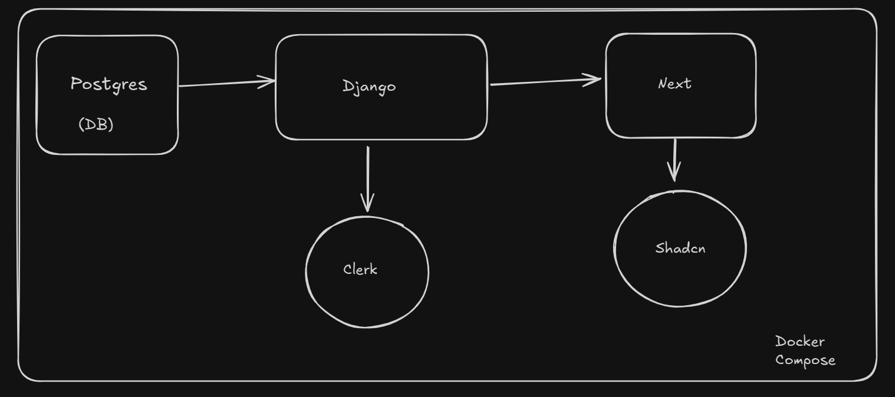
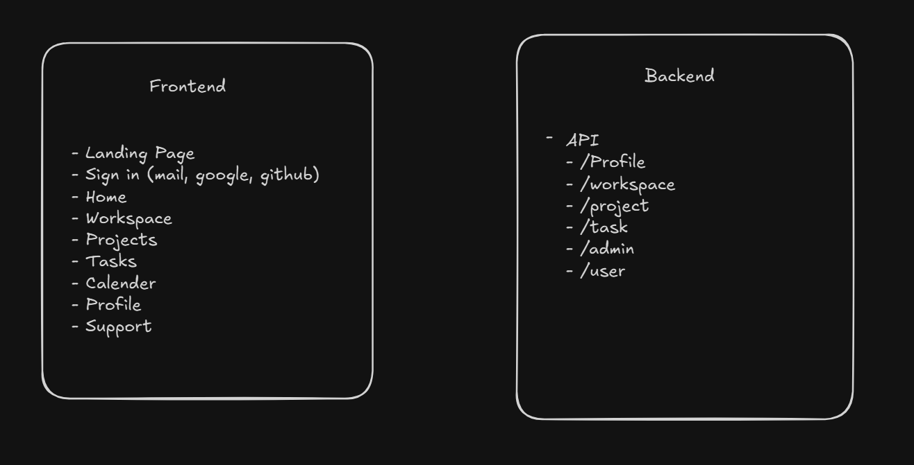
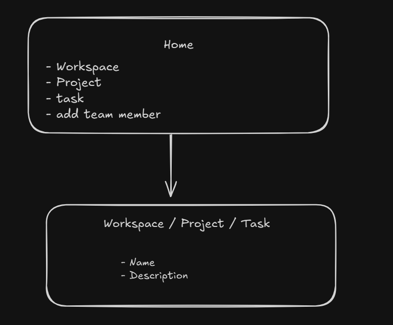

## TODO

# project setup
- [x] Add a Dockerfile
- [x] Add a docker-compose.yml
- [x] Django & Postgres setup

- [x] Setup core for basemodel, exceptions and utils
- [] Setup workspace
- [] Setup user 
- [] Setup projects 
- [] Setup tasks

